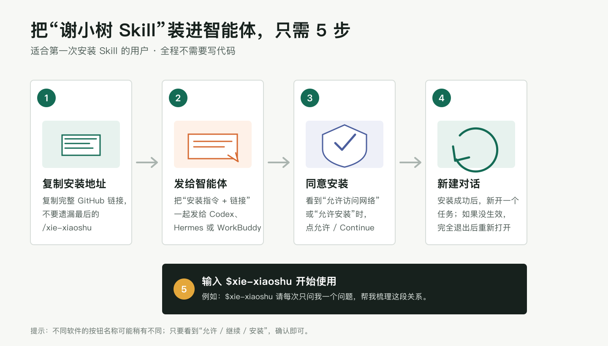
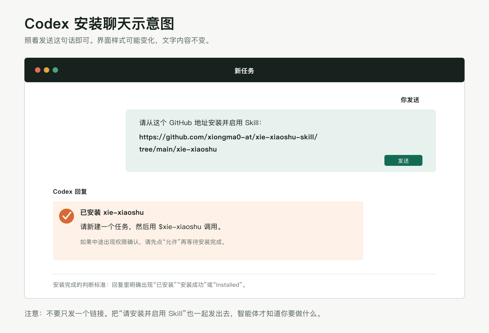
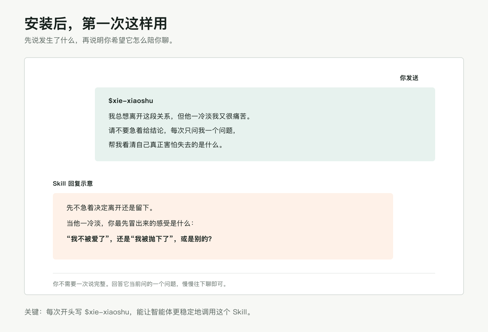
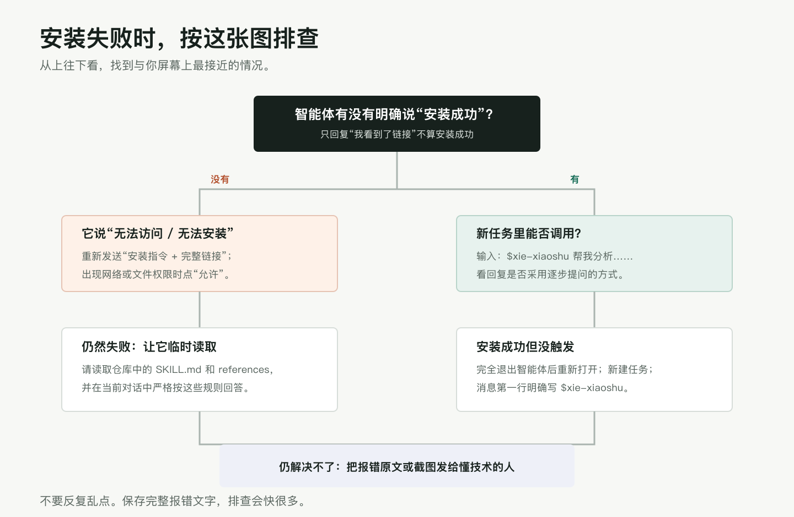

# 谢小树 Skill：安装与使用指南

这是一个供 AI 智能体使用的 Skill。安装后，智能体可以参考谢小树相关课程逐字稿中整理出的思路，用逐步提问的方式，帮助你梳理亲密关系、择偶、原生家庭、亲子、金钱、事业、自我成长和人生选择。

本指南是写给第一次接触 Skill 的用户的。你不需要会编程，也不需要自己修改文件。

> [!IMPORTANT]
> 这个 Skill 用于自我梳理和一般性讨论，不替代心理治疗、医疗诊断、法律意见或紧急援助。遇到人身危险、自伤风险、严重精神症状或其他紧急情况，请优先联系当地急救、警方、医院或可信赖的人。

## 目录

- [一分钟快速安装](#一分钟快速安装)
- [在 Codex 中安装](#方法一在-codex-中安装推荐)
- [在 Hermes Agent、WorkBuddy 等智能体中安装](#方法二在-hermes-agentworkbuddy-等智能体中安装)
- [怎样把 Skill 分享给别人](#怎样把这个-skill-分享给别人)
- [可以直接复制的提问模板](#常用方法直接复制这些提问模板)
- [安装失败排查](#常见问题与排查)
- [更新到新版本](#更新到新版本)
- [隐私、来源与使用边界](#隐私来源与使用边界)

## 一分钟快速安装

先复制下面整段文字，再把它发送给 Codex、Hermes Agent、WorkBuddy 或其他支持 Agent Skills 的智能体：

```text
请从这个 GitHub 地址安装并启用 Skill：
https://github.com/xiongma0-at/xie-xiaoshu-skill/tree/main/xie-xiaoshu
```

安装成功后，新建一个对话，发送：

```text
$xie-xiaoshu 我总想离开这段关系，但他一冷淡我又很痛苦。请不要急着给结论，每次只问我一个问题。
```



## 开始前先认识三个词

| 词语 | 简单解释 |
| --- | --- |
| 智能体 | 你正在聊天的 AI 软件，例如 Codex、Hermes Agent、WorkBuddy。 |
| Skill | 给智能体增加的一套专门工作方法。可以把它理解成“说明书 + 参考资料”。 |
| GitHub 地址 | Skill 放在网上的位置。智能体通过这个地址读取和安装文件。 |

你不需要注册 GitHub，也不需要下载三个课程逐字稿。这个仓库是公开的，安装链接可以直接访问。

## 方法一：在 Codex 中安装（推荐）

这套安装方式已经实际验证过。以下每一步只做一个动作。

### 第 1 步：打开 Codex

打开 Codex 应用，进入一个新的任务。不要在一段很长的旧对话中安装，以免智能体误解你的目的。

### 第 2 步：发送安装指令

复制下面的全部内容，包括第一行的“请从这个 GitHub 地址安装并启用 Skill”：

```text
请从这个 GitHub 地址安装并启用 Skill：
https://github.com/xiongma0-at/xie-xiaoshu-skill/tree/main/xie-xiaoshu
```

粘贴到 Codex 的输入框，然后发送。

不要只发送一个裸链接。加上“请安装并启用 Skill”，Codex 才能准确理解你的要求。



### 第 3 步：允许必要权限

安装过程中可能出现确认窗口。你可能会看到下面这些字样之一：

- 允许访问网络
- 允许执行命令
- Continue
- Allow
- Approve

确认当前操作是在访问上面的 GitHub 地址后，点击“允许”“继续”或对应按钮。

### 第 4 步：等待明确的成功回复

出现下面任意一种回复，才算安装完成：

- 已安装 `xie-xiaoshu`
- 安装成功
- Successfully installed
- Installed `xie-xiaoshu`

如果只回复“我看到了这个仓库”或“我可以读取这个文件”，不代表已经安装。请继续追问：

```text
请把它持久安装到你的 Skills 目录，并在完成后明确告诉我安装结果。
```

### 第 5 步：新建一个任务

安装完成后，不要直接在安装对话里测试。点击“新建任务”或“新建对话”。

新任务能让 Codex 重新加载已经安装的 Skill。如果新任务仍然找不到，请完全退出 Codex，再重新打开。

### 第 6 步：第一次调用

在新任务中发送：

```text
$xie-xiaoshu 我最近在一段关系里很纠结。请先不要给建议，每次只问我一个问题，帮助我看清自己真正想要什么。
```



### 第 7 步：确认调用成功

调用成功时，回复通常会有这些特点：

- 不急着替你下结论；
- 会区分事实、感受、解释和恐惧；
- 通常一次只推进一个核心问题；
- 会帮助你观察关系中的重复模式；
- 不会假装成谢小树本人，也不会编造逐字原话。

如果回复只是非常泛泛的建议，请在下一条消息中明确写：

```text
请严格使用 $xie-xiaoshu Skill。不要一次问很多问题，也不要急着给我结论。
```

## 方法二：在 Hermes Agent、WorkBuddy 等智能体中安装

不同智能体对 Skill 的支持程度不同。最简单的做法仍然是把同一段安装指令直接发给它：

```text
请从这个 GitHub 地址安装并启用 Skill：
https://github.com/xiongma0-at/xie-xiaoshu-skill/tree/main/xie-xiaoshu

安装完成后，请告诉我：
1. 是否已经持久安装；
2. 安装到了哪个目录；
3. 下一次对话应该怎样调用它。
```

智能体可能出现三种结果：

| 它的回复 | 代表什么 | 你接下来怎么做 |
| --- | --- | --- |
| “已经安装成功” | 支持从 GitHub 安装 Skill | 新建对话，用 `$xie-xiaoshu` 测试。 |
| “我能读取，但不能持久安装” | 能临时使用，关闭对话后可能失效 | 使用下面的“临时读取”指令。 |
| “我无法访问链接或安装文件” | 当前版本没有网络、文件或 Skill 权限 | 使用“下载 ZIP 手动安装”，或换到 Codex。 |

### 不能持久安装时：让它临时读取

把下面这段话发给智能体：

```text
如果你不支持持久安装，请打开下面的 Skill 目录，读取 SKILL.md 和 references 目录中的全部 Markdown 文件，并在本次对话中严格按这些规则回答：
https://github.com/xiongma0-at/xie-xiaoshu-skill/tree/main/xie-xiaoshu

读取完成后请告诉我，然后每次只问我一个问题。
```

这种方式只保证当前对话有效。新建对话后，可能需要重新发送。

### 智能体要求你提供本地文件时：下载 ZIP

1. 打开仓库首页：<https://github.com/xiongma0-at/xie-xiaoshu-skill>
2. 点击页面上的绿色 `Code` 按钮。
3. 点击 `Download ZIP`。
4. 打开下载的 ZIP 文件并解压。
5. 在解压后的文件夹中找到完整的 `xie-xiaoshu` 文件夹。
6. 把这个文件夹上传给智能体，或放到它指定的 Skills 目录。
7. 完全退出智能体，再重新打开。
8. 新建对话，用 `$xie-xiaoshu` 测试。

如果你不知道它的 Skills 目录在哪里，直接问：

```text
请告诉我你的 Skills 安装目录在哪里，并分步骤告诉我应该把 xie-xiaoshu 文件夹放到哪里。我是第一次操作，请不要省略任何一步。
```

Codex 的常见目录是：

- macOS / Linux：`~/.codex/skills/xie-xiaoshu`
- Windows：`%USERPROFILE%\.codex\skills\xie-xiaoshu`

Hermes Agent、WorkBuddy 和其他智能体的目录会随版本和安装方式变化，请以该软件自己的回复或官方文档为准。

## 怎样把这个 Skill 分享给别人

最省事的方法，是把本指南地址发给对方：

<https://github.com/xiongma0-at/xie-xiaoshu-skill>

也可以把下面这段可以直接转发的文字发给对方：

```text
这是“谢小树 Skill”的安装地址。请把下面整段话发给你使用的 AI 智能体：

请从这个 GitHub 地址安装并启用 Skill：
https://github.com/xiongma0-at/xie-xiaoshu-skill/tree/main/xie-xiaoshu

安装成功后，新建对话并输入：
$xie-xiaoshu 请每次只问我一个问题，帮我梳理现在最困扰我的事情。

详细图文教程：
https://github.com/xiongma0-at/xie-xiaoshu-skill
```

## 常用方法：直接复制这些提问模板

### 1. 亲密关系梳理

```text
$xie-xiaoshu 我在这段关系里经常感到______。最近发生的事情是______。请先帮我区分事实、感受和我的解释，每次只问一个问题。
```

### 2. 判断一段关系是否适合继续

```text
$xie-xiaoshu 我正在考虑是否继续这段关系。请不要替我做决定，帮我从关系现实、情绪安全、责任边界、冲突修复、长期目标等维度逐项梳理。一次只讨论一个维度。
```

### 3. 择偶与重复模式

```text
$xie-xiaoshu 我发现自己总会被______类型的人吸引，最后又因为______而痛苦。请帮我看看这里是否有重复模式，每次只问一个问题。
```

### 4. 原生家庭

```text
$xie-xiaoshu 每当父母______时，我就会______。请帮我看清这个反应和过去经验的联系，同时区分理解父母与为他们的行为开脱。
```

### 5. 事业与人生选择

```text
$xie-xiaoshu 我正在 A 和 B 之间做选择。A 的现实条件是______，B 的现实条件是______。请帮我区分真实愿望、外界期待、恐惧和现实代价，不要直接替我选。
```

### 6. 金钱议题

```text
$xie-xiaoshu 当我想到钱时，最明显的感受是______。最近让我焦虑的事情是______。请帮我梳理金钱背后的安全感、价值感和关系边界，一次只问一个问题。
```

### 7. 只想先把事情说清楚

```text
$xie-xiaoshu 我现在脑子很乱。请先听我描述，不要分析太快。等我说完后，帮我把事实、感受、需要和下一步可以验证的行动分别列出来。
```

## 怎样说，回答会更有帮助

建议尽量包含四类信息，但不需要一次写完：

1. 发生了什么：只写可观察到的事实。
2. 你有什么感受：例如害怕、委屈、愤怒、羞耻、孤独。
3. 你怎么理解它：例如“他不回消息就是不爱我”。
4. 你希望得到什么帮助：梳理、比较、提问、制定边界或准备沟通。

一个更清楚的例子：

```text
$xie-xiaoshu 昨晚我发了三条消息，他到今天中午都没有回复，这是我能确认的事实。我很慌，也很生气。我脑子里一直出现“他准备离开我”。请帮我先检查这个解释，每次只问一个问题。
```

不需要提供真实姓名、身份证号、住址、电话号码、公司机密、账号密码或其他敏感信息。可以用“伴侣”“家人”“同事 A”等代称。

## 常见问题与排查



### 1. 打不开 GitHub 地址

先检查地址是否完整，尤其不能遗漏最后的 `/tree/main/xie-xiaoshu`。

完整地址是：

```text
https://github.com/xiongma0-at/xie-xiaoshu-skill/tree/main/xie-xiaoshu
```

如果浏览器能打开，但智能体打不开，通常是智能体没有网络访问权限。允许网络权限后重试，或使用“下载 ZIP 手动安装”。

### 2. 提示 `Missing path`、`Skill path required` 或“缺少路径”

通常是你发了仓库首页，而不是 Skill 子目录。请使用上面的完整地址，不要只用：

```text
https://github.com/xiongma0-at/xie-xiaoshu-skill
```

### 3. 提示 `Destination already exists` 或“目标目录已存在”

这表示以前已经安装过。先尝试新建对话直接调用：

```text
$xie-xiaoshu 请告诉我你是否已经加载了这个 Skill。
```

如果旧版本损坏或需要更新，让智能体处理：

```text
请先备份现有的 xie-xiaoshu Skill，再用下面地址的最新版替换它。不要删除其他 Skill：
https://github.com/xiongma0-at/xie-xiaoshu-skill/tree/main/xie-xiaoshu
```

### 4. 安装成功，但新对话中没有反应

按顺序执行：

1. 确认消息第一行包含 `$xie-xiaoshu`。
2. 新建一个全新的对话。
3. 完全退出智能体应用。
4. 重新打开应用。
5. 再次发送调用测试。

### 5. 智能体说自己不支持 Skill

这不是链接坏了，而是该智能体没有安装能力。使用前面的“临时读取”指令，或在支持 GitHub Skills 的 Codex 中安装。

### 6. 回复一次问了很多问题

发送：

```text
请停一下。从现在开始每次只问我一个问题，等我回答后再继续。
```

### 7. 回复像是在模仿真人或编造原话

发送：

```text
不要声称你是谢小树本人，也不要编造她说过的原话。请只使用 Skill 中整理的方法，并清楚区分事实、推断和一般性建议。
```

### 8. 还是无法解决

请保留完整报错，不要只说“失败了”。把以下内容一起发给协助你的人：

- 你使用的智能体名称和版本；
- 你发送的完整安装指令；
- 屏幕上的完整报错文字；
- 权限确认窗口的截图；
- 你是否能够在浏览器中打开 GitHub 地址。

## 更新到新版本

以后仓库内容更新时，可以把这段话发给智能体：

```text
请检查我已经安装的 xie-xiaoshu Skill，并从下面地址更新到最新版。更新前请备份旧版本，不要改动其他 Skill：
https://github.com/xiongma0-at/xie-xiaoshu-skill/tree/main/xie-xiaoshu
```

更新完成后，完全退出智能体，再重新打开。

## 隐私、来源与使用边界

- 当前 Skill 基于用户提供的《护航课逐字稿》《人生剧透 2 期逐字稿》《人生剧透 3 期文字稿》整理。
- 原始 DOCX 逐字稿没有上传到这个公开仓库。
- Skill 中保存的是方法、工作流程、主题索引和安全边界，不是完整课程内容。
- 它不会假装成谢小树本人，也不应该伪造逐字引语。
- 它适合帮助你慢下来、澄清体验和比较选择，不适合替你做重大医疗、法律、投资或人身安全决定。

## 给懂技术的用户

Skill 的实际目录位于：

```text
xie-xiaoshu/
├── SKILL.md
├── agents/
│   └── openai.yaml
└── references/
    ├── dialogue-workflow.md
    ├── domain-playbooks.md
    ├── methodology.md
    ├── safety-and-scope.md
    ├── sources.md
    └── style.md
```

Codex 安装必须使用带子目录的 GitHub 地址：

```text
https://github.com/xiongma0-at/xie-xiaoshu-skill/tree/main/xie-xiaoshu
```

仓库首页适合阅读本指南；带 `/tree/main/xie-xiaoshu` 的地址适合安装。
